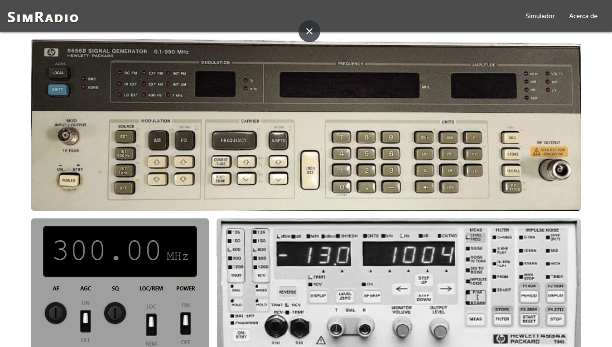

# Simradio
Entorno web para simulación de pruebas Rx en transceptores radio.

## 📸 Vista previa

*Interfaz principal del simulador*

## 🚀 Inicio Rápido
1. Clona el repo.
2. Abre `index.html` en tu navegador.

## 🧠 Documentación técnica
Si quieres conocer los detalles de ingeniería, el stack tecnológico y los desafíos resueltos en este proyecto, consulta la: 👉 [Ficha detallada del Proyecto (Project Overview)](./docs/simradio.md)