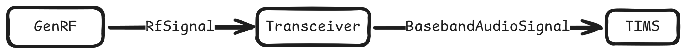

# SimRadio
Entorno web para simulación de pruebas Rx en transceptores radio.

## Motivación
Necesidad de mejorar las habilidades del personal técnico en un entorno seguro y controlado.

## Solución
La solución integra una cadena de procesado de señal compuesta por tres bloques funcionales: un **Generador de RF**, un **Transceptor** (etapa de demodulación y procesado) y un **TIMS** (sistema de instrumentación y monitorización de audio).

Desde el generador de radiofrecuencia podemos crear una señal RF, que será la entrada del transceptor. Éste, procesará la señal de entrada y otorgará una señal de audio. Con el TIMS, veremos la frecuencia del tono y la calidad.

La reactividad de los componentes se gestiona mediante el uso de callbacks. Cada bloque expone un método de conexión que permite vincularlo a otro; así, ante cualquier cambio en el estado interno, el bloque no solo ejecuta su propio método `render`, sino que también dispara la función de actualización del bloque conectado, garantizando la sincronización de la interfaz.

## Stack detallado
- **Lógica de Simulación**: JavaScript ES6+ (Programación Orientada a Objetos).
- **Interfaz**: HTML5 y CSS3 con diseño modular.
- **Procesado**: Arquitectura basada en eventos (callbacks) para el flujo de señales.

## Arquitectura 
### Webapp
La webapp está estructurada en tres páginas HTML:
- **Inicio (index.html)**: Entorno de simulación
- **Configuración (config.hmtl)**: Pagina para configurar el comportamiento del transceptor y del modelo de procesamiento de señal.
- **Acerca de (about.html)**: Página para mostrar más acerca del proyecto.

La navegación entre módulos se gestiona mediante un componente de cabecera (*header*) común.

### Señal y procesamiento
El flujo de datos es unidireccional y reactivo. El Generador encapsula parámetros de frecuencia y amplitud en un objeto `RfSignal`, que el `Transceiver` procesa mediante algoritmos de demodulación para generar un objeto `BasebandAudioSignal`. Finalmente, el `TIMS` actúa como un sumidero de datos (data sink) para el analisis de calidad y frecuencia.

## Logros

Con el desarrollo de esta webapp he conseguido interiorizar los conceptos de componentes web, que son la base de como funcionan los frameworks y librerias como React, Vue, Angular, etc. a grandes rasgos.

El uso de esta herramienta para su fin, ha dado lugar a un personal técnico más capacitado y con los conceptos, referentes a las pruebas de calidad de un transceptor en Rx, interiorizados. Esto permite una mayor eficacia en el trabajo y una respuesta rápida ante incidentes o averias.